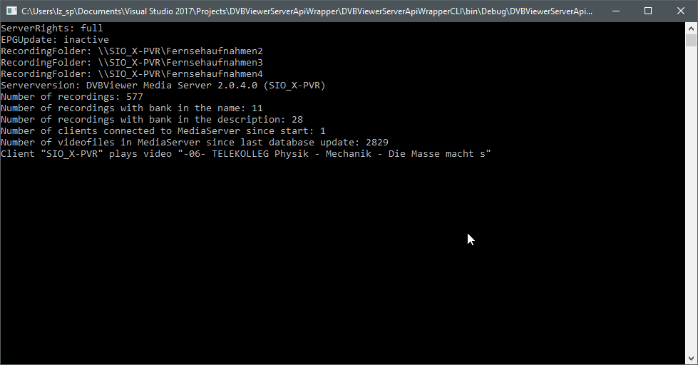

# DVBViewerServerApiWrapper

Der DVBViewerServerApiWrapper ist eine Bibliothek, welche die webbasierte API in die .Net Welt holt.
Sie wird unter der Verwendung des MediaServers von DVBViewer entwickelt.

DVBViewerServerApiWrapper is a lib that brings the web-based API into the .Net world. 
It is developed using DVBViewer's MediaServer.

www.dvbviewer.com

### Current state (Aktueller Status)

Version 0.0.2.1

Retrieve data
- parse the service API into .Net objects (readonly)


Daten abrufen
- umwandeln der Daten von der Service API in .Net Objekte (nur lesen)

Symbols: Ready, 
 Work, 
 ToDo, 
 Abort, Canceled

<br/> status2.html
<br/> version.html
<br/> dvbcommand.html
<br/> recordings.html
<br/> mediafiles.html -> own implementation over the sql.html
<br/> getconfigfile.html
<br/> setting.html -> maybe unnecessary (double support to status2.html)
<br/> getchannelsxml.html
<br/> recdelete.html
<br/> epg.html
<br/> epgclear.html
<br/> timerlist.html
<br/> timeradd.html
<br/> timeredit.html
<br/> timerdelete.html
<br/> tasks.html
<br/> sideload.html
<br/> startts.html
<br/> stopts.html
<br/> searchlist.html
<br/> searchdelete.html
<br/> searchedit.html
<br/> searchadd.html
<br/> sql.html - integration in all relevant classes

### Using the lib

```C#
    class Program
    {
        static void Main(string[] args)
        {
            var dvbServ = new DVBViewerServerApi
            {
                IpAddress = "Name-of-PC or IpAddress",
                Password = "password for guest or admin",
                User = "username for guest or admin",
                Port = 8089
            };

            try
            {
                
               //Get the serverstatus if online
                var status = dvbServ.Serverstatus;

                Console.WriteLine($"ServerRights: {status.Rights}");
                Console.WriteLine($"EPGUpdate: {status.EPGUpdate}");
                foreach (var item in status.RecordingFolders)
                {
                    Console.WriteLine($"RecordingFolder: {item.Folder}");
                }

                var version = dvbServ.ServerVersion;
                Console.WriteLine($"Serverversion: {version.ServerVersion}");

                //All current recordings
                var recsAll = dvbServ.Recordings;
                Console.WriteLine($"Number of recordings: {recsAll.Items.Count}");

                //All current recordings in a shorter and faster way
                var recs = dvbServ.RecordingsShort;

                //All hist recordings ever since database exists (maybe recordings have been deleted, but here exist a copy of the base data)
                var histRecs = dvbServ.RecordedList;

                //All current recordings with "bank" in the name
                var recsN = dvbServ.GetRecordings("bank");
                Console.WriteLine($"Number of recordings with bank in the name: {recsN.Items.Count}");

                //All current recordings with "bank" in the description
                var recsD = dvbServ.GetRecordingsByDescription("bank");
                Console.WriteLine($"Number of recordings with bank in the description: {recsD.Items.Count}");

                //All connected Clients since media server restarts as PC-Names
                var clients = dvbServ.DVBViewerClients;
                Console.WriteLine($"Number of clients connected to MediaServer since start: {clients.Items.Count}");

                var videofiles = dvbServ.VideoFileList;
                Console.WriteLine($"Number of videofiles in MediaServer since last database update: {videofiles.Items.Count}");

                //Neuer Zufallsgenerator
                var rnd = new Random();
                //Neue Zufallszahl erzeugen
                int next = rnd.Next(videofiles.Items.Count);
                //Dem ersten Clienten ein zufälliges Video abspielen lassen
                clients.Items[0].PlayVideo(videofiles.Items[next]);
                Console.WriteLine($"Client \"{clients.Items[0].Name}\" plays video \"{videofiles.Items[next].Title}\"");
            }
            catch (Exception ex)
            {
                Console.WriteLine(ex.Message);
            }

            Console.ReadKey();
        }
    }
```

